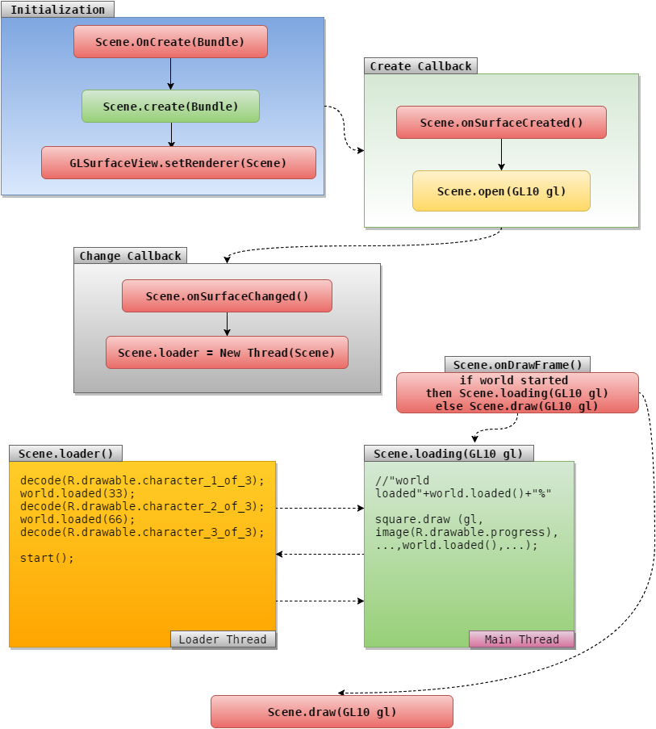

game.android
================

27 class 2d game framework for any Android version supporting OpenGL ES 1.0

Checkut a simple game source using this framework at https://github.com/hazardland/ferry.android

While some real world applications were done using this tiny framework it still aims to be as simple 
as possible for learning purposes same time staying full functional. Use it to know what basic 
happens processes do happen behind the scene of big opengl 2D frameworkes.

Here is a brief illustration of framework lifecycle:



Requirements
------------

1. Just include library

Showcase
------------
We create cloud using resource image located at R.drawable.cloud2
```JAVA
    public class Cloud2 extends Entity
    {
        public Cloud2 (Scene scene)
        {
            super (scene, -1, 500, 600, 243, 52, R.drawable.cloud2);
            job (new Move (Move.X, 0-size.width, scene.screen.width, -5, 0, false, 0));
        }
    }
```
We create scene
```JAVA
    public class Scene2 extends Scene
    {
        protected void onCreate (Bundle state)
        {
            config.sensor = false;
            create (state);
        }

        //initialize resources for loader progress bar
        public void open (GL10 gl)
        {
            image (gl, R.drawable.progress_background);
            image (gl, R.drawable.progress_foreground);
        }
        //progress loading, progress loading, progress loading...
        public void loading (GL10 gl)
        {
            square.draw (gl, images.get (R.drawable.progress_background), display.width/2-206, display.height/2-20, 412f, 40f);
            square.draw (gl, images.get (R.drawable.progress_foreground), display.width/2-200, display.height/2-10, world.load()*4, 20, 0, 0f, 1f, 0f, 1f);
            //System.out.println ("loading "+world.loaded()+"%");
        }
        //here is actually what we load:
        public void loader ()
        {
            decode (R.drawable.sky);
            decode (R.drawable.bird1);
            decode (R.drawable.bird2);
            world.loaded(55); //world loaded progress 50%
            decode (R.drawable.bird3);
            decode (R.drawable.cloud1);
            //We load cloud image as well as other images
            decode (R.drawable.cloud2);
            decode (R.drawable.cloud3);
            hold ();

            //This is some class like cloud extending Entity class
            new Background (this);
            new Cloud1 (this);
            //Here is our class initing
            new Cloud2 (this);
            new Cloud3 (this);
            new Cloud4 (this);

            //Throw our Entity child classes into eternal world loop for drawing
            //As world will extract coordinates and staff from them and draw them on the screen
            //And world will also notify them that new frame (FPS) redraw is going to happen and
            //it is time to change coordinates and staff if needed
            world.start ();
        }
    }
```


Drow a dragable cards
------------------
I took http://www.luckyladygames.com/wp-content/uploads/2013/08/videopoker_cards.gif and saved as PNG in photoshop then added as a resource R.drawable.cards

Crated a global class of card:

```JAVA
public class Card extends Entity
{
    //Card types
    public static final int COVER = 0;
    public static final int HEARTS = 1;
    public static final int DIAMONDS = 2;
    public static final int CLUBS = 3;
    public static final int SPADES = 3;
    public static final int JOKER = 6;
    //Card values
    public static final int JACK = 11;
    public static final int QUEEN = 12;
    public static final int KING = 13;
    public static final int ACE = 14;
    //Calculated card size in given sprite source image
    public static final int WIDTH = 125;
    public static final int HEIGHT = 181;
    //Card identity
    public int type;
    public int value;
    public Card (Scene scene, int type, int value, int cell, int row)
    {
        //Create game entity giving it position on screen and size
        super (scene, cell*WIDTH, row*HEIGHT, WIDTH, HEIGHT);

        //store card identity
        this.type = type;
        this.value = value;

        //Pick card sprite(single background texture) position from image
        if (type==COVER)
        {
            sprite(0, HEIGHT*4, R.drawable.cards);
        }
        else if (type==JOKER)
        {
            sprite(WIDTH*1, HEIGHT*4, R.drawable.cards);
        }
        else
        {
            //This calculations are strictly derived from given image topology
            sprite ((value-2)*WIDTH,(type-1)*HEIGHT, R.drawable.cards);
        }

        //Enable dragging
        drag (true);
    }
}
```

And than make main activity:

```JAVA
public class Main extends Scene
{
    protected void onCreate (Bundle state)
    {
        //Enable touch sensor
        config.sensor = true;
        //Initialize gl scene
        create (state);
    }
    public void loader ()
    {
        //Load image texture into GPU RAM
        decode (R.drawable.cards);

        //Create some cards
        new Card (this, Card.COVER, 0, 0, 0);
         new Card (this, Card.HEARTS, 6, 2, 0);
        new Card (this, Card.DIAMONDS, 6, 3, 0);
        new Card (this, Card.CLUBS, Card.JACK, 4, 0);
        new Card (this, Card.SPADES, Card.QUEEN, 5, 0);

        //Start rendering
        world.start();
    }
}
```